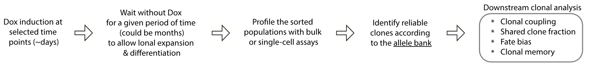
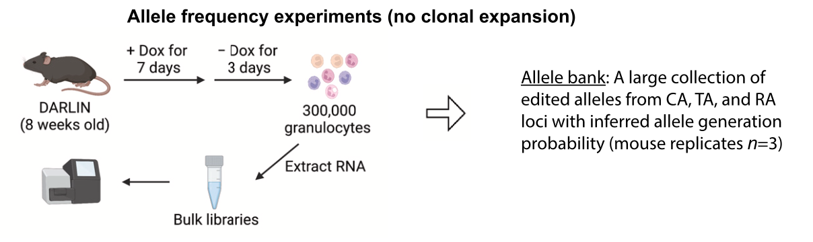
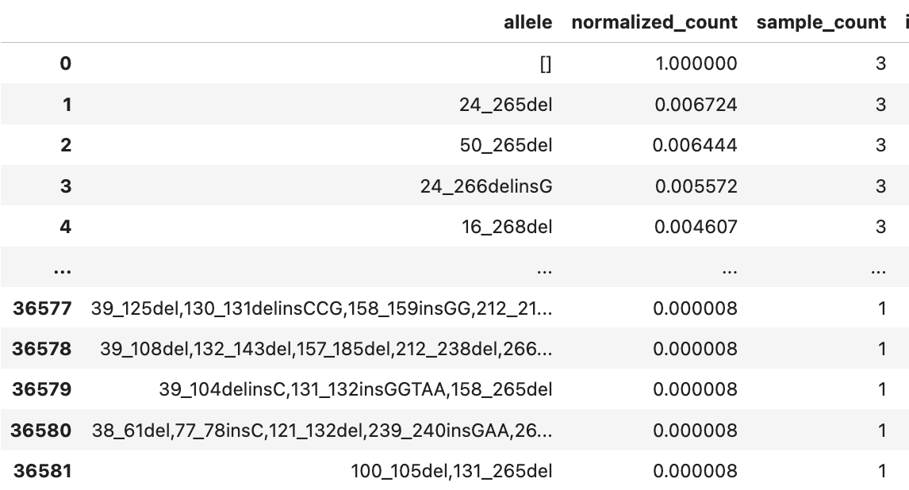

# MosaicLineage

A (mosaic) collection of python help functions related to lineage tracing data analysis, developed through the DARLIN project [L. Li,...,S.-W. Wang, F. Camargo, Cell (2023)](https://doi.org/10.1016/j.cell.2023.09.019).

It is often used together with [cospar](https://cospar.readthedocs.io/en/latest/index.html)

To install, run
```bash
git clone https://github.com/ShouWenWang-Lab/MosaicLineage
cd MosaicLineage
pip install -r requirements.txt
python setup.py develop
```

Its usage can be examplified in the [notebooks for the DARLIN project](https://github.com/ShouWenWang-Lab/DARLIN_notebooks).


## Reference allele bank

Since alleles are generated in different frequencies, in a given experiment where we need to barcode a given size of population, we need to determine those (rare) alleles that can reliably label clones. The workflow of an actual lineage tracing experiment and its downstream analysis is as below.



We carried out an experiment designed to measure the allele frequency, as below.


From this experiment, we curated a large collection of alleles, from the CA, TA, and RA locus of DARLIN, with estimated generation probability for each allele. These reference allele data, or allele bank, are located under the folder `reference`. In particular, `reference_merged_alleles_{X}_Gr.csv`, with `X=CA, TA, or RA`, is the reference files created using alleles profiled from Granulocytes (the above allele frequency experiment) with minimum complication from heterogeneous clone proliferation.



As you can see from the above, each allele is described by `normalized_count`, a score for its generation probability, and `sample_count`, the number of mouse replicates that this allele was observed (maximum is 3 in this file). This normalized count is derived by normalizing against sequencing depth as well as the expression differences between the three loci. Please check the Method section `Allele bank construction` and `Homoplasy probability inference` in our paper for details.  The higher `sample_count` or the `normalized_count`, the more frequent this allele will be generated during Dox induction.

Besides these allele bank experiment, we also have many small experiments not specifically designed to measure the allele generation frequency. In such experiments, the number of times that an allele was detected would depend both on its intrinsic frequency, as well as the extent of proliferation of its corresponding clone. Since we have several mouse samples for such experiments, we can still use the information `sample_count`, to indicate whether this allele is more frequent or not, while not using the `UMI_count` for these alleles. Therefore, we generated `reference_merged_alleles_{X}.csv` files, with `X=CA,TA or RA`, where we updated the `sample_count` as the total mouse samples that an allele was observed across all these experiments, but kept `normalized_count` as the same as in `reference_merged_alleles_{X}_Gr.csv`.

In practice, you can use two criteria to select reliable alleles: (`normalized_count` <  $\rho^*$) and (`sample_count` < $m$). Check `Clone identification: practice` for more ideas on how to select reliable alleles. Also, check our [notebooks](https://github.com/ShouWenWang-Lab/DARLIN_notebooks) to see how they were used in the applications of the DARLIN project. 

The allele generation probability cutoff $\rho^*$ should depend on the size of initial population when barcoding happens. See our Methods section `Clone identification: theory` for details.


## Miscellaneous

Finally, historically we have named CA, TA, RA as CC, TC, and RC. We have not corrected this terminology throughout this package, as well as the deposited raw and processed data in GEO: GSE222486.

In other words, these terms are equivalent: `CC` <-> `CA`, `TC` <-> `TA`, `RC` <-> `RA`, 
